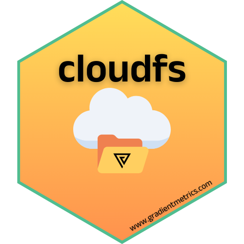

# cloudfs <a href="https://g6t.github.io/cloudfs/"></a>

`cloudfs` is an R package developed by [Gradient Metrics](www.gradientmetrics.com) that offers a unified interface for simplifying cloud storage interactions. `cloudfs` supports uploading, downloading, reading, and writing files for both Google Drive and Amazon S3.

## Installation

``` r
remotes::install_github("g6t/cloudfs")
```

## Key Features

1.  **Relative path simplicity**

    Use paths relative to your project's main cloud folder.

    ``` r
    cloud_drive_download("raw_data/transactions.xlsx")
    ```

2.  **Unified interface for Google Drive and S3**

    Downloading from S3? The process is just as straightforward.

    ``` r
    cloud_s3_download("raw_data/transactions.xlsx")
    ```

3.  **Extension-aware functions**

    The package automatically selects the right read or write function based on the file extension, simplifying your interactions.

    ``` r
    cloud_s3_write(glmnet_model, "models/glmnet.rds")
    ```

    If you don't like the default function, you can use a different one by explicitely calling it.

    ``` r
    cloud_s3_write(glmnet_model, "models/glmnet.rds", fun = readr::write_rds)
    ```

4.  **Effortless cloud navigation**

    Open folders in browser

    ``` r
    cloud_drive_browse("plots")
    ```

    or list contents in console.

    ``` r
    cloud_s3_ls("data")
    ```

5.  **Bulk file management**

    Easily retrieve all data from a folder in one go

    ``` r
    all_data <- 
      cloud_s3_ls("data") %>%
      cloud_s3_read_bulk()
    ```

    or push multiple files to the cloud at once.

    ``` r
    cloud_local_ls("plots") %>% cloud_drive_upload_bulk()
    ```
