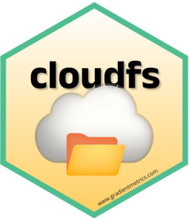

# cloudfs <a href="https://g6t.github.io/cloudfs/"></a>

`cloudfs` is an R package that offers a unified interface for simplifying cloud
storage interactions, including uploading, downloading, reading, and writing
files, with functions for both Google Drive and Amazon S3.

## Installation

```R
remotes::install_github("g6t/cloudfs")
```

## Key Features

1. **Relative path simplicity**

   Use paths relative to your project's main cloud folder.
   ```R
   cloud_drive_download("raw_data/transactions.xlsx")
   ```

2. **Unified Interface for Google Drive and S3**

   Downloading from S3? The process is just as straightforward.
   ```R
   cloud_s3_download("raw_data/transactions.xlsx")
   ```
   
3. **Extension-aware functions**

   The package automatically selects the right read or write function based on
   the file extension, simplifying your interactions.
   
   ```R
   cloud_s3_write(glmnet_model, "models/glmnet.rds")
   ```

4. **Effortless cloud navigation**

   Open folders in browser:
   ```R
   cloud_drive_browse("plots")
   ```
    
   or list contents in console:
   ```R
   cloud_s3_ls("data")
   ```

5. **Bulk File Management**

   Easily read all data files from an S3 folder in one go.
   ```R
   cloud_s3_ls("data") %>% cloud_s3_read_bulk()
   ```
